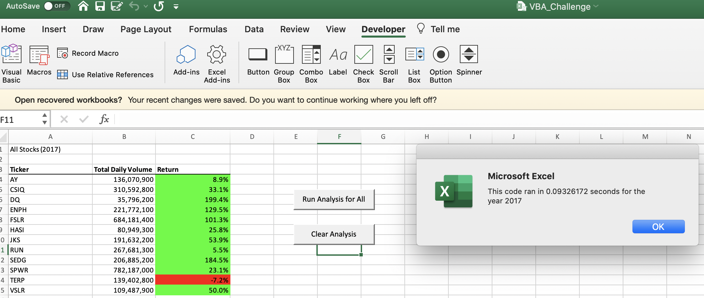
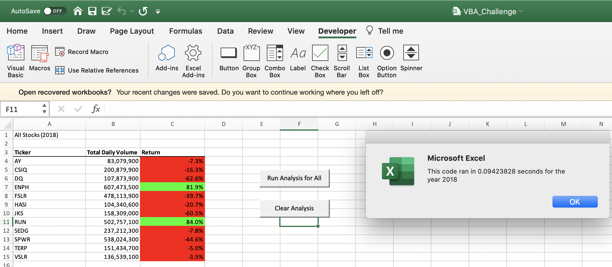

# Looking at Stocks and Providing analysis
## Overview of Project
  * The purpose of this project was to expand upon the analysis done with our Client Steve via our VBA excel workbook to analyze a whole dataset of stocks from the stock market beyond just "DQ", but an additional 11 stocks. To further help Steve and his family examine the stock market and decide the right stock to invest in, our excel workbook was adjusted to be more efficient and comprehensible. This modification was achieveable by refactoring our code in a way that would "run" the VBA script more efficiently through precise and improved logic of our code. The refactoring of code was the needed "editing" to output the needed information of stock returns and total volume at a much faster rate. 

### Results of Refactoring
 * **Analysis** - As previously noted, the refined data of our VBA analyis project was made possible by the refactoring of our code. Put simply, slight edits in our code that included the introduction of newly defined arrays such as "tickers", "tickerVolume", "tickerStartingPrices", "tickerEndPrices", and a new variable called "tickerIndex" were the plethora of new inputs added to the code to bolster the efficiency of the analysis. The inclusion of an additional array, tickerVolumes, and a variable such as the tickerIndex to act as key to access the stock data of tickers, tickerVolumes, and ticker starting and ending prices, provides an improved logic to the code that allows for faster output as images 1 (Year 2017) and images 2 (Year 2018) show below.                               
* **Execution time** - From the previous module, AllStocksAnalysis, the code ran in 0.4960938 seconds for the year 2017 sheet analysis and 0.484375 seconds for the year 2018 sheet analysis. The execution time of of the refactored AllstockAnalysis demonstrates a faster rate of output as the year 2017 sheet analysis ran in 0.09326172 seconds and 0.09423898 secondsfor the 2018 sheet analysis. An explanation of a faster rate of execution for the refactored AllStockAnalysis can be identified by the inclusion of additional for loops within the refactored coding process. The additional arrays and variables along with the power of for loops to perform tasks accordingly to output the neccessary data, demonstrate the immense differnce small changes in the coding process make. 
* **Stock Performances** - From the data set of the All Stock Analysis sheet, a noteworthy distinction is made that the stock market in the year 2017 had great return of stock for 11 out the 12 companies as every stock aside from TERP had a positive return. Most notably, the stocks of FSLR, ENPH, and DQ had over 100% return of value for their respective stock. If Steve's family had gone for DQ stock back in 2017 then they would've benefitted greatly as DQ had a return of 199%. Steve's family however were not able to reap the benefits of DQ's 2017 impressive stock return as 2018 was a dire market for stock holders. Whereas 2017 was a boom for the stock market, 2018 could be described as a recession as 2 out of the 12 stocks met their returns. ENPH again was able to meet a positive return for its stock along with ticker RUN. In comparison to its 2017 positive 199% return, DQ's 2018 return was at negative 63%. 

### Summary
* **Advantages of Refactoring** - Based upon the analysis of the stock market data sheet from the refactored VBA Script, many insights can be made about the functionality of refactoring code. Advantages that stand out from the refactoring of code is the efficiency in which slight edits and inclusions of codes can make an immense difference in how smoothly code can run. Also impressive is how these slight changes can produce the needed information at a much more efficient rate. Even more impressive is the logical aspect of how minor tweaks to the code can make an immense difference in how the analysis is ran. An improved coding logic can factor into an overall improved coding process. Take for example how the VBA script ran much faster by simply adding more variables, arrays, and for-loops in the coding logic to output the needed data at a much faster rate. The readability of the code also plays an incremental role as each variable is defined. Going line by line and being able to add additional comments in the code to ensure an understanding and reduced complexity of the code are advantages refactoring presented when coding for the VBA project. While the Original VBA script was effective in its analysis, the obvious improvements in run time and continued functionality of the refactored VBA script cannot be overlooked. 
* **Disadvantages of Refactoring** - While refactoring code can be advantageous and have its benefits, sometimes there are 
